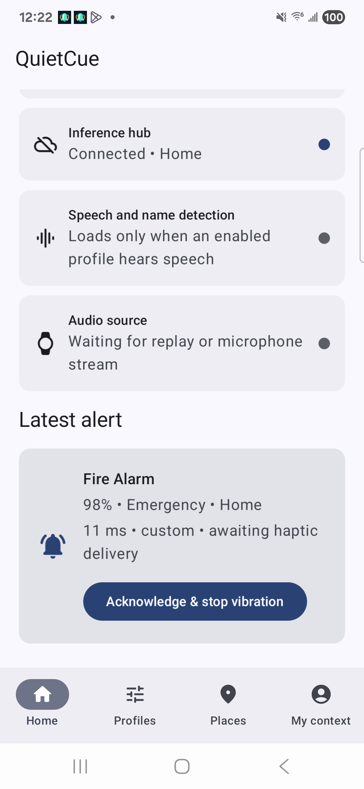
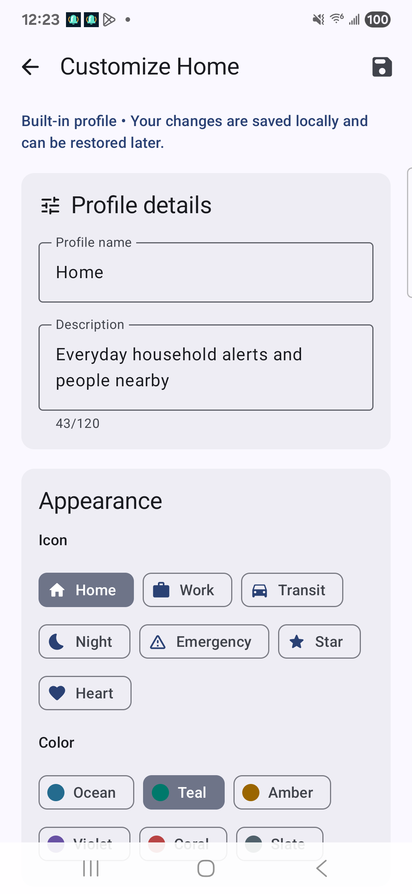
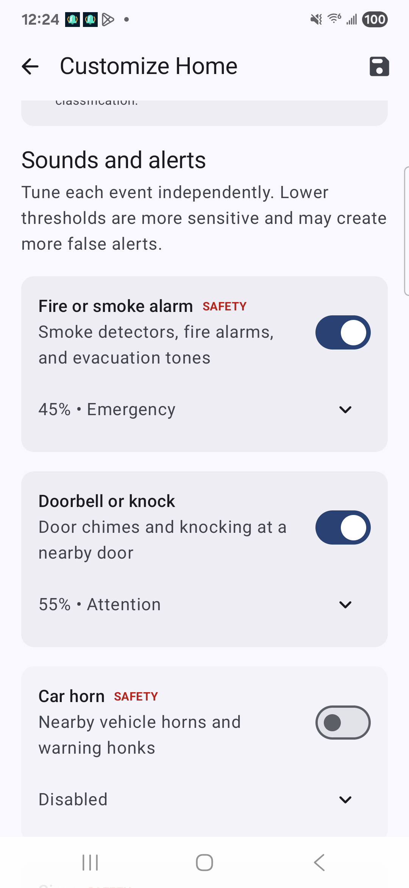
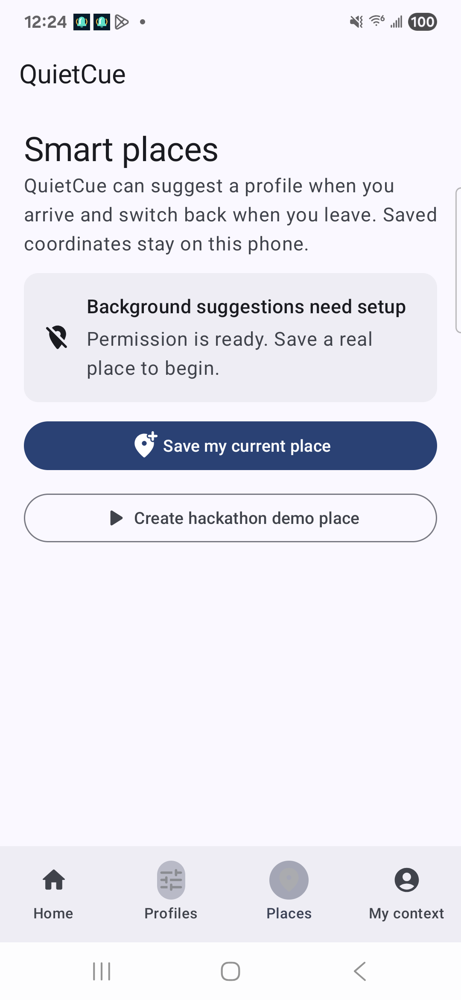
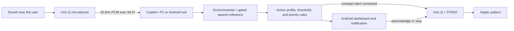

# QuietCue

**An open-source haptic awareness system for deaf and hard-of-hearing people.**

QuietCue recognizes important sounds and spoken cues, decides what matters in
the user's current context, and turns each alert into a clear vibration on an
Arduino Uno Q wearable. The core experience runs locally on Qualcomm hardware:
no cloud connection, account, or subscription is required.

**Snapdragon Multiverse Hackathon 2026** · Qualcomm and Arduino

| | |
|---|---|
| **Local by default** | Environmental and speech inference stay on the connected Copilot+ PC or Android phone |
| **1.45 ms mean inference** | Measured full fp32 YAMNet path on the Snapdragon X Elite Hexagon NPU |
| **Context-aware** | Five built-in profiles, quiet hours, Smart Places, custom sounds, and name detection |
| **Open source** | Android app, inference hub, Uno Q client, STM32 haptics, tests, and documentation under MIT |

---

## App preview

<table>
  <tr>
    <td width="50%" align="center">
      
      <br /><strong>Actionable alerts</strong><br />Event, confidence, urgency, profile, latency, haptic delivery, and acknowledgement in one view.
    </td>
    <td width="50%" align="center">
      
      <br /><strong>Personal profiles</strong><br />Create a recognizable profile with its own purpose, icon, color, context, and behavior.
    </td>
  </tr>
  <tr>
    <td width="50%" align="center">
      
      <br /><strong>Sound-by-sound control</strong><br />Enable each event and tune its sensitivity, priority, haptic cue, strength, cooldown, and acknowledgement.
    </td>
    <td width="50%" align="center">
      
      <br /><strong>Private Smart Places</strong><br />Suggest the right profile on arrival and switch back on departure while coordinates remain on the phone.
    </td>
  </tr>
</table>

## Why QuietCue exists

Many safety and social cues are designed to be heard: a smoke alarm, car horn,
doorbell, crying baby, ringing phone, kitchen timer, or someone calling your
name. Phone notifications can help, but only after the user notices and reads
the screen. A single generic vibration also does not communicate whether an
event is informational, needs attention, or is urgent.

QuietCue creates a small, learnable haptic language. It identifies the event,
applies the user's profile and preferences, and sends the wearable only the
urgency and vibration pattern it needs. The phone shows the exact event and
technical details; the wearable communicates importance immediately.

## How it works



1. A USB microphone connected to the Uno Q captures mono audio without saving
   raw recordings.
2. The Uno Q streams short PCM chunks over Wi-Fi to one selected inference hub:
   the Copilot+ PC or the Android companion.
3. YAMNet classifies environmental audio continuously. Speech transcription
   runs only when the active profile enables it: the hub keeps a short rolling
   buffer and hands Whisper one utterance window at a time, so quiet names and
   names spoken across a chunk boundary are still heard.
4. QuietCue applies confidence thresholds, quiet hours, cooldowns, custom sound
   matches, and the active Home, Work, Driving, Sleep, or Emergency profile.
5. Approved alerts return as small semantic commands such as `urgent_repeat`;
   raw audio never travels back to the wearable.
6. The STM32 owns precise motor timing while the app shows the event, confidence,
   active profile, latency, connection state, and confirmed delivery status.

If the network drops, the Uno Q client reconnects with bounded backoff and never
guesses at a safety-critical event. The deterministic motor controller can
finish an alert pattern that has already been delivered.

## A haptic language, not a vibration for every sound

| Category | Default cue | Meaning |
|---|---|---|
| **Emergency** | Repeated urgent pulses | Act now; continues until acknowledged or timed out |
| **Attention** | One longer pulse | Check the app soon |
| **Informational** | Two short pulses | Something happened; check the phone for details |

Users can adjust strength, acknowledgement, cooldowns, and patterns per sound.
The touch-driven pattern creator records one to six pulses directly on the
phone, previews them, validates safe timing bounds, and synchronizes the result
to the hub and wearable.

## iPhone demo without the wearable

`frontend/ios/` contains a SwiftUI app that plays both roles: the iPhone
microphone streams to the Mac hub over the same TCP protocol as the Uno Q, the
iPhone's haptic engine plays the same motor patterns, and every Android
companion screen (Home, Profiles, Places, My context) is available. Run
`./scripts/run_ios_demo.sh` on the Mac and open `frontend/ios/QuietCue.xcodeproj`.
See `frontend/ios/README.md` and `docs/IOS_DEMO_PLAN.md`.

## The Android companion

The native Android app is the control center for QuietCue:

- **Dashboard:** active profile, PC/phone inference selection, Uno Q connection,
  latest event, confidence, latency, and hardware-confirmed haptic delivery.
- **Profiles:** Home, Work / School, Driving / Transit, Sleep / Night, Emergency,
  and custom profiles with per-sound rules and quiet hours.
- **Custom sound teaching:** a guided ten-second session learns a repeated sound
  from the live Uno Q microphone, rejects speech-dominated samples, and discards
  raw audio after extracting local fingerprints.
- **My Context:** encrypted, user-entered names, pronunciations, people, phrases,
  and contextual hints for local name recognition. QuietCue never invents
  memories from background conversations.
- **Smart Places:** private on-phone geofences can suggest or automatically apply
  a profile at Home, Work, or School while protecting recent manual choices.
- **Actionable notifications:** emergency alerts can be acknowledged or stopped
  from the app or notification action.

The phone can also become the environmental inference hub using the checked-in
W8A8 YAMNet ONNX model. The user can switch between Samsung and PC inference
without restarting the Uno Q stream; the PC remains the automatic fallback if
the phone disconnects.

## Edge AI on the Qualcomm stack

| Component | Role | Runtime |
|---|---|---|
| **YAMNet (AudioSet, 521 classes)** | Environmental sound classification | ONNX Runtime QNN on Snapdragon X Elite; ONNX Runtime Android on phone |
| **Faster-Whisper** | Gated local phrase and name transcription on the PC | CPU worker, separate from environmental inference |
| **Whisper ONNX** | Optional staged phone speech path | Lazy Android worker |
| **QUAD** | Conversion, profiling, orchestration, and generated runner validation | Snapdragon X Elite and connected target workflows |
| **Arduino App Lab Bridge** | Semantic alert delivery from Linux to the STM32 | Uno Q |

### Measured on Snapdragon X Elite

The benchmark covers a complete one-second PCM chunk classification: PCM16 to
log-mel features, inference, sigmoid, and top results.

| Variant | Provider | Mean | p95 |
|---|---|---:|---:|
| fp32 baseline | CPUExecutionProvider | 30.46 ms | 86.72 ms |
| **fp32 deployed path** | **QNN / Hexagon NPU** | **1.45 ms** | **1.74 ms** |
| W8A8 | CPUExecutionProvider | 16.20 ms | 74.26 ms |
| W8A8 | QNN / Hexagon NPU | 1.33 ms | 3.63 ms |

The fp32 NPU path was selected because it preserves reference accuracy and has
more deterministic tail latency. The 0.5–1 second capture window, not model
execution, dominates the user-perceived response time. Full methodology and raw
results are in [`docs/benchmarks/QUAD_AUDIO_MODEL.md`](docs/benchmarks/QUAD_AUDIO_MODEL.md).

## Hardware

| Component | Responsibility |
|---|---|
| **Snapdragon X Elite Copilot+ PC** | Primary inference, profile decisions, telemetry, and development dashboard |
| **Arduino Uno Q Linux side** | Microphone capture, PCM streaming, reconnection, and alert transport |
| **Uno Q STM32 side** | Deterministic vibration timing, button input, and status control |
| **Android phone** | Companion UI and optional alternate inference hub |
| **Vibration motor + driver** | Physical alert output through a MOSFET/transistor and suitable protection circuitry |

The motor must never be powered directly from a GPIO pin. Wiring and board
deployment guidance are in [`uno_q/stm32/README.md`](uno_q/stm32/README.md) and
[`docs/UNO_Q_MICROPHONE.md`](docs/UNO_Q_MICROPHONE.md).

## Getting started

### Fast software showcase

Requires Git and Python 3.10 or newer. No model download, phone, or Uno Q is
needed for this deterministic end-to-end verification.

```bash
git clone https://github.com/AkshajBharadwaj/QuietCue.git
cd QuietCue

python3 scripts/run_no_hardware_demo.py --event fire_alarm --profile home
python3 scripts/run_no_hardware_demo.py --event doorbell_knock --profile sleep
```

The first command produces an emergency `urgent_repeat` alert. The second shows
the same pipeline suppressing a doorbell under the Sleep profile.

### Real classifier on the Copilot+ PC

On Windows PowerShell:

```powershell
.\scripts\run_demo.ps1 -Classifier onnx -NoSpeech
```

The launcher creates `.venv`, installs `backend/requirements-onnx.txt`, and
starts the audio hub plus state API. Open
`http://127.0.0.1:8787/api/state` to inspect the live system. Stop with Ctrl+C.

On macOS, Linux, or WSL:

```bash
./scripts/run_demo.sh --showcase
```

After the one-time Uno Q setup, start the real microphone, connected ONNX hub,
and physical haptics together:

```bash
./scripts/run_demo.sh --live
```

Detailed setup is intentionally kept out of this overview:

- [Uno Q microphone and deployment](docs/UNO_Q_MICROPHONE.md)
- [Android build, install, and phone inference](frontend/android/README.md)
- [Three-minute live demo](docs/DEMO.md)
- [No-hardware workflow](docs/NO_HARDWARE_DEMO.md)

## Tests

Backend protocol, profile, speech, enrollment, reconnection, and end-to-end
simulation tests run without the optional ML packages:

```bash
python3 -m unittest discover -s tests -v
```

Android unit tests:

```bash
cd frontend/android
./gradlew testDebugUnitTest
```

## Architecture and project evidence

- [System architecture](docs/ARCHITECTURE.md)
- [Verified implementation status](docs/PROJECT_STATUS_2026-08-06.md)
- [QUAD conversion and profiling](docs/benchmarks/QUAD_AUDIO_MODEL.md)
- [Profile assistant and custom sound enrollment](docs/PROFILE_AGENT_AND_ENROLLMENT.md)
- [Identity, memory, and privacy model](docs/IDENTITY_AND_MEMORY.md)
- [Smart profile suggestions](docs/SMART_PROFILE_SUGGESTIONS.md)

## Safety and privacy

QuietCue is a research prototype, not a certified life-safety or medical device.
It must not be the sole means of detecting an emergency. The default runtime
does not store raw microphone audio, the critical alert path has no cloud
dependency, and secrets belong in environment variables rather than the
repository.

## Team

| Name | Email |
|---|---|
| Akshaj Bharadwaj | akshaj.bharadwaj@gmail.com |
| Rohan Krishnan | rohankrishnan2000@gmail.com |
| Rikhil Rao | raorikhil@gmail.com |
| Shreya Shirsathe | sshirsathe2023@gmail.com |
| Sarayu Pochimireddy | sarayu.pr11@gmail.com |

## License

**MIT** — see [`LICENSE`](LICENSE). Build on it, adapt it, and make important
sounds more accessible.
