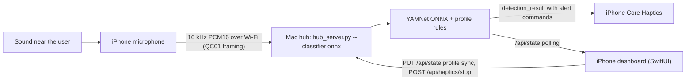

# iPhone demo plan

**Goal:** demo the complete QuietCue experience with only an iPhone and a Mac.
The iPhone plays the role of both the Uno Q wearable (microphone in, vibration
out) and the Android companion app (dashboard, profiles, places, my context).
Sound classification stays on the Mac.



## Why this works without changes to the hub

- `backend/app/hub_server.py` is a plain TCP server. The only contract is the
  wire protocol in `backend/communication/stream_protocol.py` (`QC01` magic,
  two big-endian lengths, JSON document, PCM payload). Any client can be the
  "edge" device.
- The hub answers each `audio_chunk` with `detection_result` containing
  `alerts` (`pattern`, `strength`, `event_id`, `requires_ack`) and
  `control_commands` (`stop_haptic`). That is exactly what the Uno Q's
  `AlertDispatcher` consumes; the iPhone implements the same dispatcher.
- The Android dashboard only ever talks to the status API on port 8787
  (`GET /api/state`, `PUT /api/state`, `POST /api/haptics/stop`,
  enrollment endpoints). The iPhone app uses the same endpoints.
- The STM32 sketch (`uno_q/stm32/haptics/sketch/sketch.ino`) defines the exact
  motor timings, so the phone's Core Haptics patterns copy them:

  | Pattern | Steps (on ms, off ms) | Repeats |
  |---|---|---|
  | `short_pulse` | (300, 260) | 1 |
  | `two_short` | (240, 140), (240, 320) | 1 |
  | `long_pulse` | (1000, 350) | 1 |
  | `urgent_repeat` | (250, 100), (250, 100), (250, 400) | until stop or 30 s |
  | `custom` | user-recorded | 1, or until stop when ack is required |

  Strength maps `gentle` / `standard` / `strong` to 190 / 230 / 255 motor
  intensity; on the phone that becomes haptic intensity 0.75 / 0.90 / 1.0.

## What was built (all steps complete, each verified in the iOS Simulator)

1. **Xcode project scaffold** in `frontend/ios/` (hand-written project using
   Xcode's synchronized folders, so new Swift files are picked up without
   editing the project). Builds and tests from the command line.
2. **Core loop:** wire protocol, TCP client with reconnect/backoff, microphone
   capture converted to 16 kHz mono PCM16 in 1 s chunks (one full YAMNet
   patch; shorter chunks are zero-padded on the hub and score poorly), edge analysis
   (RMS/peak/VAD, ported from `edge_analyzer.py`), Core Haptics dispatcher
   with the Uno Q dedup/cooldown rules, `haptic_result` reporting so the hub
   marks alerts as delivered, status API client, and the **Home** tab that
   matches the Android dashboard.
3. **Profiles tab:** built-in profiles, editor, sound rules, touch-recorded
   custom haptic creator, validator, local persistence, and the strict
   profile-sync JSON the hub validates in `backend/profiles/wire_codec.py`.
4. **Places tab:** Core Location geofences, suggestions, manual-override
   policy, demo place with simulated arrival/departure.
5. **My context tab:** identity, people, and manual context stored with iOS
   data protection. Enrolling a name is enough to be alerted on it; the
   "Listen for my name" button asks the Mac's own Whisper model how it spells
   the name (`/api/name-enrollment/*`) and keeps only that spelling.
   **Settings tab:** speech detection on/off, Whisper model (Tiny/Base/Small,
   applied on the hub through profile sync), match strictness, people-name
   alerts, global phrases, and privacy-safe speech diagnostics.
6. **Enroll a sound / Describe a situation** flows (hub enrollment API and the
   local text agent).
7. **Notifications** with an acknowledge action, background audio mode.
8. **Run script, docs, and tests** (Swift tests for framing, edge analysis,
   and the sync codec; `tests/test_ios_profile_sync.py` decodes a
   Swift-produced document with the hub codec; a UI screenshot tour).

### Verified end to end (simulator + Mac hub, 2026-09-08)

- Simulator microphone → hub: YAMNet ONNX classified live chunks at ~2.4 ms
  inference; speech through the Mac speakers registered as "Speech".
- With `--classifier demo`, a 1 kHz tone produced `ALERT COMMAND urgent_repeat:
  fire_alarm (98%)`, the phone reported `HAPTIC delivered`, and the hub's
  latest alert flipped to `simulated: false` with a 17 ms decision latency.
- `POST /api/haptics/stop` queued a control command that the phone honored.
- Profile sync was accepted: `Active profile synchronized: Home (8 rules …)`.
- The phone reconnected on its own after the hub restarted.

## Setup on the Mac

```bash
./scripts/run_ios_demo.sh            # installs onnxruntime/onnx/numpy if needed, binds on 0.0.0.0, prints the LAN IP
./scripts/run_ios_demo.sh --classifier demo   # tone classifier for dry runs without real alarms
```

For a convincing live demo with the real classifier, play recordings of real
alarms, doorbells, or sirens; synthetic tones only trigger the demo classifier.

## Setup on the iPhone

Open `frontend/ios/QuietCue.xcodeproj`, pick your personal team under Signing,
plug the phone in, run. Enter the Mac's LAN IP on the Home tab once; it is
remembered. Both devices must be on the same Wi-Fi.

## Known limitations

- **Vibration needs the app in the foreground.** Core Haptics is stopped by
  iOS when the app is backgrounded. The app requests the background-audio
  mode so the microphone stream keeps running with the screen locked, and it
  posts a local notification for alerts, but the haptic pattern itself only
  plays while QuietCue is on screen. Keep the phone unlocked on the app during
  the demo.
- **No on-device inference.** The Android app can run YAMNet on the phone.
  The iPhone app shows the inference-device card with the PC selected and the
  phone option disabled.
- **Colors use the app's own palette.** The Android screenshots show a navy
  palette because Samsung applies wallpaper-derived dynamic color. iOS has no
  equivalent, so the app uses the teal palette defined in
  `frontend/android/.../theme/Theme.kt`.
- **Hub address entry is new UI.** The Android app reaches the hub through
  `adb reverse` on localhost; the iPhone needs a field for the Mac's address.
- **Free Apple ID signing** expires after seven days; rerun from Xcode.
- **Speech / name detection on the hub** needs `pip install faster-whisper`.
  The run script disables speech unless it is present.
- **Name detection (September 2026 overhaul).** Alerts used to be suppressed by
  three things: the match score was multiplied by Whisper's sentence
  log-probability and then held to the 0.60 profile threshold; each 1 s iPhone
  chunk was transcribed alone; and audio was dropped before Whisper whenever
  the edge/YAMNet voice gate was closed. Now the event confidence is the match
  score alone (ASR confidence is only a 0.20 floor against hallucinations),
  the hub keeps a 6 s rolling buffer and submits a windowed utterance (2.5 s
  max, oldest audio first) with 0.8 s pre-roll after about 450 ms of silence,
  trims trailing silence out of the window, waits up to 600 ms for the decode
  so the alert lands in the same chunk cycle, and rejects short or repeated
  name transcripts below 0.5 confidence as Whisper prompt echoes ("I'm Rohan
  Rohan." on a silent tail was measured at 0.38); name_called cooldown is 5 s
  so consecutive calls both register; the prompt is transcript-style
  (`Rohan. Hey Rohan.`) rather than prose, pronunciation guides are no longer
  hotwords, and `speech_diagnostics` (window length, match score, ASR
  confidence, reject reason) rides on every detection result. Measured on this
  Mac with int8 CPU: tiny.en about 150 ms, base.en about 300 ms, small.en about
  1 s per 3 s window; beam search added 10-30 % without changing output and
  word timestamps cost 4-6 s, so both stay off.
